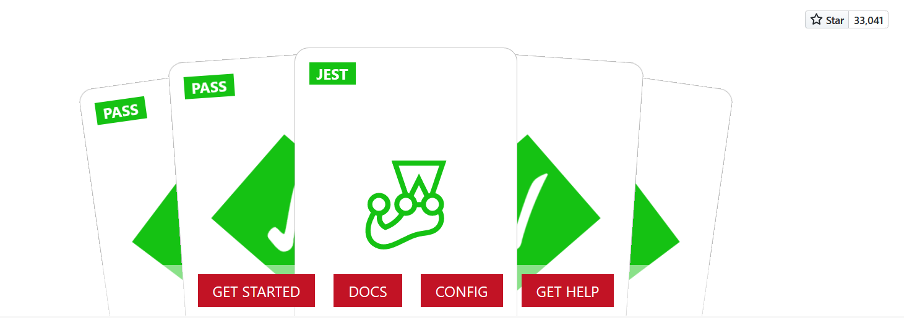

## 一、JEST简介


Jest是Facebook开源的一套JavaScript测试框架， 它集成了断言、JSDom、覆盖率报告等开发者所需要的所有测试工具。

> 官方简介：一个令人愉快的javascript测试框架。
> 我的理解是，不用加班改bug了，可以提前下班，陪女朋友喝奶茶！

## 二、jest启步
## 2.1 安装
```bash
# 项目中使用
yarn init -y
yarn add --dev jest
# 或者全局安装，随时随地使用
yarn global add jest  
```

## 2.2 hello world(jest)
```javascript
// hello.js
module.exports = function(){
    return "hello world";
}
// hello.test.js
const hello = require('../hello');

it('should ', () => {
    expect(hello()).toBe('hello world');
});

```

## 三、基础测试知识

## 3.1 jest文件和目录命名规范
待测试文件: `hello.js`
测试脚本文件取名：`hello.test.js`or`hello.spec.js`
测试目录:`tests`or`__tests__`


## 3.2 测试函数
```javascript
test("测试用列描述信息",()=>{

})
// or
it("测试用例描述信息",()=>{

})
```

## 3.3 断言函数
> 测试即运行结果是否与我们预期结果一致
> 断言函数用来验证结果是否正确
```javascript
exspect(运行结果).toBe(期望的结果);
//常见断言方法
expect({a:1}).toBe({a:1})//判断两个对象是否相等
expect(1).not.toBe(2)//判断不等
expect({ a: 1, foo: { b: 2 } }).toEqual({ a: 1, foo: { b: 2 } })
expect(n).toBeNull(); //判断是否为null
expect(n).toBeUndefined(); //判断是否为undefined
expect(n).toBeDefined(); //判断结果与toBeUndefined相反
expect(n).toBeTruthy(); //判断结果为true
expect(n).toBeFalsy(); //判断结果为false
expect(value).toBeGreaterThan(3); //大于3
expect(value).toBeGreaterThanOrEqual(3.5); //大于等于3.5
expect(value).toBeLessThan(5); //小于5
expect(value).toBeLessThanOrEqual(4.5); //小于等于4.5
expect(value).toBeCloseTo(0.3); // 浮点数判断相等
expect('Christoph').toMatch(/stop/); //正则表达式判断
expect(['one','two']).toContain('one'); //不解释
```

## 3.4 分组函数
```javascript
describe("关于每个功能或某个组件的单元测试",()=>{
    // 不同用例的单元测试
})
```

## 3.5 常见命令
```json
{
  "nocache": "jest --no-cache", //清除缓存
  "watch": "jest --watchAll", //实时监听
  "coverage": "jest --coverage",  //生成覆盖测试文档
  "verbose": "npx jest --verbose" //显示测试描述
}
```

## 四、基础测试

## 4.1 对象等值测试
```javascript
describe('对象测试', () => {

    it("是否同一个对象", () => {
        const foo = { a: 1 }
        expect(foo).toBe(foo)
    })

    it("对象值是否相等", () => {
        expect({ a: 1, foo: { b: 2 } }).toEqual({ a: 1, foo: { b: 2 } })
    })

    test('对象赋值', () => {
        const data = { one: 1 };
        data['two'] = 2;
        expect(data).toEqual({ one: 1, two: 2 });
    });

});
```

## 4.2 异步测试
异步测试脚本执行完，单元测试就结束了，如果需要延时才能断言的结果，单元测试函数需要设置`done`形参，在定时回调函数中调用，显示的通过单元测试已完成。
```javascript
describe('异步操作测试',  () => {
    function foo(callback) {
        console.log('foo...')
        setTimeout(() => {
            callback && callback();
        }, 1000)
    }
    it('异步测试', (done) => {
        function bar() {
            console.log('bar..')
            done();
        }
        foo(bar);
    });
});

```
## 4.3 定时器测试（异步测试）及断言
基于jest提供的两个方法`jest.useFakeTimers`和`jest.runAllTimers`可以更优雅的对延时功能的测试。
```javascript
describe('定时器相关测试', () => {
    // 开启定时函数模拟
    jest.useFakeTimers();
    
    function foo(callback) {
        console.log('foo...')
        setTimeout(() => {
            callback && callback();
        }, 1000)
    }
    it('断言异步测试', () => {
        //创建mock函数，用于断言函数被执行或是执行次数的判断
        const callback = jest.fn();
        foo(callback);
        expect(callback).not.toBeCalled();
        //快进，使所有定时器回调
        jest.runAllTimers();
        expect(callback).toBeCalled();
    })
});
```
## 4.4 Dom测试
实现dom渲染测试，以及点击事件等交互功能测试。
```javascript
describe('Dom测试', () => {
    it('测试按钮是否被渲染 ', () => {
        document.body.innerHTML = `
    <div>
        <button id='btn'>小按钮</button>
    </div> `
        console.log(document.getElementById('btn'), document.getElementById('btn').toString())
        expect(document.getElementById('btn')).not.toBeNull();
        expect(document.getElementById('btn').toString()).toBe("[object HTMLButtonElement]");
    });

    it('测试点击事件', () => {
        const onclick = jest.fn();
        document.body.innerHTML = `
        <div>
            <button id='btn'>小按钮</button>
        </div> `
        const btn = document.getElementById('btn');
        expect(onclick).not.toBeCalled();
        btn.onclick = onclick;
        btn.click();
        expect(onclick).toBeCalled();
        expect(onclick).toHaveBeenCalledTimes(1);
        btn.click();
        btn.click();
        expect(onclick).toHaveBeenCalledTimes(3);
    });
});
```


## 五、Vue测试
## 5.1 安装unit-jest
如果你创建的项目没有安装unit-jest依赖包，可以通过`vue add @vue/unit-jest`命令添加。否则通过脚手架手动模式创建一个包含unit-jest的项目。

## 5.2 基础知识
**mount和shallowMount的区别**
- shallowMount只挂载指定组件，不挂载子组件
- mount挂载所有组件

**Vue的渲染机制**
默认情况下 Vue 会异步地批量执行更新 (在下一轮 tick)，以避免不必要的 DOM 重绘或者是观察者计算
> 异步测试需要在nextTick()之后执行

## 5.3 hello Jest Vue
vue组件渲染测试
```javascript
it('挂载countBtn组件', () => {
        const wraper = shallowMount(CountBtn);
        const btn = wraper.find("button");
        expect(wraper.html()).toBe(`<button>点击次数0</button>`);
    });
```

## 5.4 事件测试
vue组件点击事件测试
```javascript
it('测试countBtn组件点击', (done) => {
    const wraper = shallowMount(CountBtn);
    const btn = wraper.find("button");
    expect(wraper.html()).toBe(`<button>点击次数0</button>`);
    btn.trigger('click');
    setTimeout(() => {
        expect(wraper.html()).toBe(`<button>点击次数1</button>`);
        done();
    }, 1000);
});

it('优雅的测试点击事件', async () => {
    const wraper = shallowMount(CountBtn);
    const btn = wraper.find("button");
    expect(wraper.html()).toBe(`<button>点击次数0</button>`);
    btn.trigger('click');
    await wraper.vm.$nextTick();
    expect(wraper.html()).toBe(`<button>点击次数1</button>`);
});
```

## 5.5 axios异步请示测试
模拟异步请示，测试渲染结果是否一致
```html
<!-- User.vue -->
<template>
<table>
    <tr v-for="item in list" :key="item.id">
        <td>{{item.id}}</td>
        <td>{{item.name}}</td>
        <td>{{item.age}}</td>
    </tr>
</table>
</template>

<script>
export default {
    data() {
        return {
            list: []
        }
    },
    created() {
        this.$http.get('/user').then(({
            data
        }) => {
            this.list = data
        })
    }
}
</script>
```

```javascript
// User.spec.js
import { mount } from '@vue/test-utils';
import User from '@/components/User';

it('测试用户组件', async() => {
    const wrapper = mount(User,{
        mocks:{
            $http:{
                get: url=>Promise.resolve({data:[{id:1,name:'xxxx',age:18},{id:2,name:'yyyy',age:19}]})
            }
        }
    })
    console.log(wrapper.html())
    // 渲染前
    expect(wrapper.html()).toBe('<table></table>');
    await wrapper.vm.$nextTick();
    // 渲染后
    // console.log(wrapper.html())
    // console.log(wrapper.find('tr'))
    expect(wrapper.findAll('tr').length).toBe(2)
    expect(wrapper.findAll('td').at(2).html()).toBe('<td>18</td>')
    
});
```

## 六、demo源码
[github地址](http://github.com/calcyu/jest-study-demo)
demo中还包含`express+restful`接口的测试用例，不想用`postman`测试接口的同学，可以用jest来代替。

> 顺手点个小爱心，以示鼓励。


